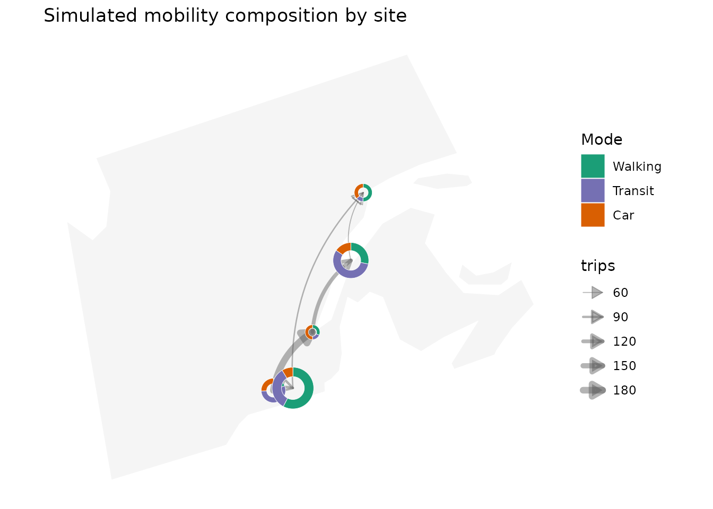
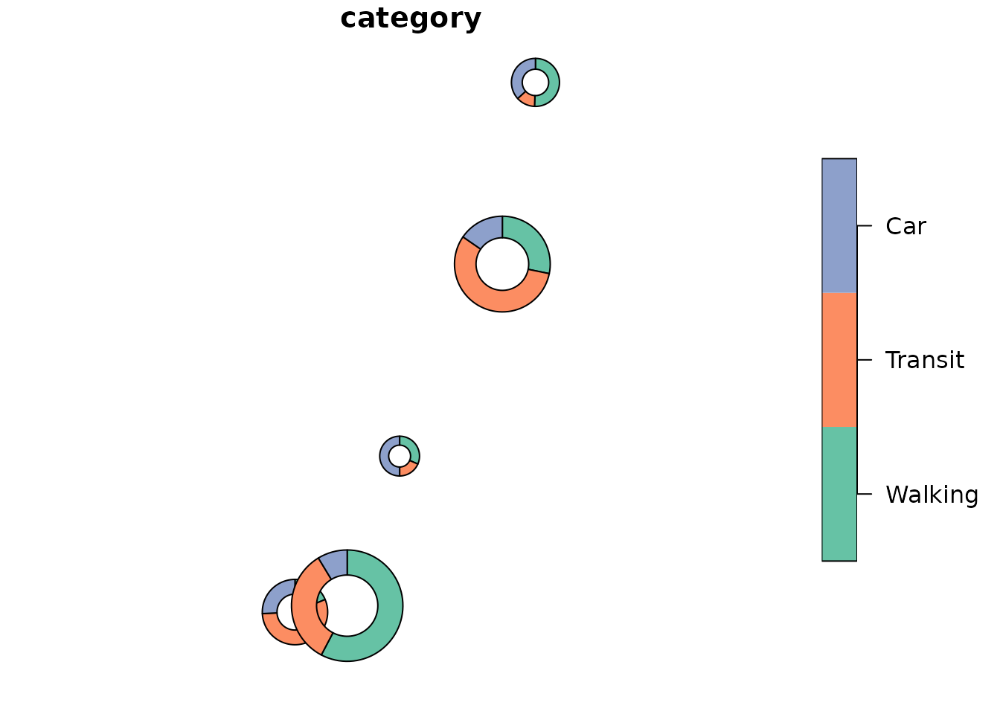

# Donut maps with DonutMap

DonutMap creates donut charts positioned on a map from tidy data. The
package has three main workflows:

1.  [`donut_polygons()`](https://aureliennicosiaulaval.github.io/DonutMap/reference/donut_polygons.md)
    creates an `sf` polygon layer.
2.  [`donut_map()`](https://aureliennicosiaulaval.github.io/DonutMap/reference/donut_map.md)
    creates a static `ggplot2` map.
3.  [`donut_leaflet()`](https://aureliennicosiaulaval.github.io/DonutMap/reference/donut_leaflet.md)
    creates an interactive `leaflet` map with clickable donut segments
    and optional links or curved trajectories.

The examples below use a Natural Earth boundary loaded with
`rnaturalearth` (Natural Earth, n.d.,
<https://www.naturalearthdata.com/>). The point-level category values
and origin-destination trajectories are simulated for demonstration.

``` r

library(DonutMap)
library(ggplot2)
library(sf)
#> Linking to GEOS 3.12.1, GDAL 3.8.4, PROJ 9.4.0; sf_use_s2() is TRUE

set.seed(20260522)
```

## Example data

The input data are tidy: each row gives a value for one category at one
location. Locations can be supplied either as longitude and latitude
columns or as an `sf` object.

``` r

sites <- data.frame(
  site = c("Site A", "Site B", "Site C", "Site D", "Site E"),
  lon = c(-73.57, -71.21, -72.75, -68.52, -66.82),
  lat = c(45.50, 46.81, 45.40, 48.45, 50.22)
)

categories <- c("Walking", "Transit", "Car")

demo <- merge(
  sites,
  data.frame(category = categories),
  by = NULL
)

demo$value <- c(
  32, 48, 120,
  55, 80, 95,
  28, 70, 110,
  20, 44, 76,
  18, 30, 58
)

demo$category <- factor(demo$category, levels = categories)

flows <- data.frame(
  from = c("Site A", "Site A", "Site B", "Site C", "Site D"),
  to = c("Site B", "Site C", "Site D", "Site E", "Site E"),
  trips = c(180, 90, 120, 70, 60)
)

category_colours <- c(
  Walking = "#1b9e77",
  Transit = "#7570b3",
  Car = "#d95f02"
)
```

For a background map, this vignette crops the Natural Earth Canada
boundary to eastern Canada. The donut values and flow values remain
simulated.

``` r

canada <- rnaturalearth::ne_countries(
  country = "Canada",
  returnclass = "sf"
)

eastern_canada <- sf::st_crop(
  canada,
  sf::st_bbox(
    c(xmin = -81, ymin = 44, xmax = -62, ymax = 53.5),
    crs = sf::st_crs(4326)
  )
)
#> Warning: attribute variables are assumed to be spatially constant throughout
#> all geometries
```

## Static map

[`donut_map()`](https://aureliennicosiaulaval.github.io/DonutMap/reference/donut_map.md)
returns a normal `ggplot` object, so additional `ggplot2` layers,
scales, labels, and themes can be added afterwards. The `flows` argument
adds links between donut locations. Use `flow_curvature = 0` for
straight links, and larger positive or negative values for curved
trajectories.

``` r

donut_map(
  demo,
  site,
  category,
  value,
  lon = lon,
  lat = lat,
  map = eastern_canada,
  crs = 3347,
  radius_range = c(25000, 70000),
  colours = category_colours,
  flows = flows,
  from = from,
  to = to,
  flow_value = trips,
  flow_linewidth_range = c(0.3, 2.2),
  flow_curvature = 0.22,
  flow_arrow = TRUE
) +
  labs(
    title = "Simulated mobility composition by site",
    fill = "Mode",
    linewidth = "Trips"
  ) +
  theme(legend.position = "right")
```



## Interactive map

[`donut_leaflet()`](https://aureliennicosiaulaval.github.io/DonutMap/reference/donut_leaflet.md)
returns a `leaflet` htmlwidget. Donut segments and trajectory lines,
including arrowheads, can be clicked to open popups, and hover labels
are enabled by default. By default, interactive donuts are constructed
in EPSG:3857, the display projection used by Leaflet, which keeps the
sector boundaries visually regular on screen.

``` r

donut_leaflet(
  demo,
  site,
  category,
  value,
  lon = lon,
  lat = lat,
  map = eastern_canada,
  radius_range = c(25000, 70000),
  colours = category_colours,
  flows = flows,
  from = from,
  to = to,
  flow_value = trips,
  flow_weight_range = c(1, 7),
  flow_curvature = 0.22,
  flow_arrow = TRUE,
  flow_arrow_size = 45000,
  flow_colour = "#1f2937",
  flow_opacity = 0.75
)
```

## Trajectory geometries

[`flow_lines()`](https://aureliennicosiaulaval.github.io/DonutMap/reference/flow_lines.md)
returns the trajectory layer directly as an `sf` object. This is useful
when you want to build a custom map layer or inspect the geometry before
plotting.

``` r

trajectories <- flow_lines(
  flows,
  demo,
  from,
  to,
  trips,
  site,
  lon = lon,
  lat = lat,
  crs = 3347,
  flow_curvature = 0.22,
  flow_n = 40
)

trajectories
#> Simple feature collection with 5 features and 3 fields
#> Geometry type: LINESTRING
#> Dimension:     XY
#> Bounding box:  xmin: 7631610 ymin: 1244380 xmax: 7933770 ymax: 1910206
#> Projected CRS: NAD83 / Statistics Canada Lambert
#> # A tibble: 5 × 4
#>   from   to     value                                                   geometry
#>   <chr>  <chr>  <dbl>                                           <LINESTRING [m]>
#> 1 Site A Site B   180 (7631610 1244380, 7632825 1250853, 7634155 1257251, 76355…
#> 2 Site A Site C    90 (7631610 1244380, 7633203 1245308, 7634801 1246199, 76364…
#> 3 Site B Site D   120 (7763098 1440475, 7763754 1448083, 7764551 1455617, 77654…
#> 4 Site C Site E    70 (7697210 1252459, 7696045 1271925, 7695261 1291254, 76948…
#> 5 Site D Site E    60 (7892189 1681853, 7890745 1688166, 7889433 1694454, 78882…
```

## Using the geometry layer directly

For more specialized workflows,
[`donut_polygons()`](https://aureliennicosiaulaval.github.io/DonutMap/reference/donut_polygons.md)
returns the donut segments as valid `sf` polygons.

``` r

donuts <- donut_polygons(
  demo,
  site,
  category,
  value,
  lon = lon,
  lat = lat,
  crs = 3347,
  radius_range = c(25000, 70000)
)

donuts
#> Simple feature collection with 15 features and 8 fields
#> Geometry type: POLYGON
#> Dimension:     XY
#> Bounding box:  xmin: 7590543 ymin: 1182476 xmax: 7963944 ymax: 1940386
#> Projected CRS: NAD83 / Statistics Canada Lambert
#> # A tibble: 15 × 9
#>    id     category value total proportion radius start_angle end_angle
#>    <chr>  <fct>    <dbl> <dbl>      <dbl>  <dbl>       <dbl>     <dbl>
#>  1 Site A Walking     32   171     0.187  41076.       1.57      0.395
#>  2 Site A Transit     95   171     0.556  41076.       0.395    -3.10 
#>  3 Site A Car         44   171     0.257  41076.      -3.10     -4.71 
#>  4 Site B Walking     48   152     0.316  25000        1.57     -0.413
#>  5 Site B Transit     28   152     0.184  25000       -0.413    -1.57 
#>  6 Site B Car         76   152     0.5    25000       -1.57     -4.71 
#>  7 Site C Walking    120   208     0.577  70000        1.57     -2.05 
#>  8 Site C Transit     70   208     0.337  70000       -2.05     -4.17 
#>  9 Site C Car         18   208     0.0865 70000       -4.17     -4.71 
#> 10 Site D Walking     55   195     0.282  60155.       1.57     -0.201
#> 11 Site D Transit    110   195     0.564  60155.      -0.201    -3.75 
#> 12 Site D Car         30   195     0.154  60155.      -3.75     -4.71 
#> 13 Site E Walking     80   158     0.506  30180.       1.57     -1.61 
#> 14 Site E Transit     20   158     0.127  30180.      -1.61     -2.41 
#> 15 Site E Car         58   158     0.367  30180.      -2.41     -4.71 
#> # ℹ 1 more variable: geometry <POLYGON [m]>
```

You can use that object with any package that accepts `sf` polygons.

``` r

plot(donuts["category"])
```


